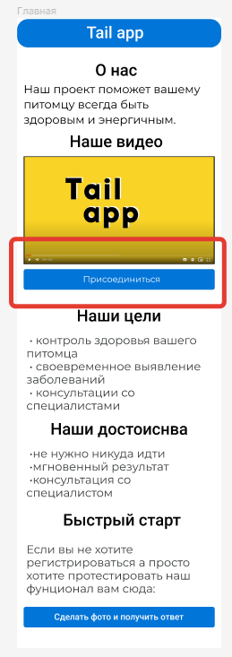
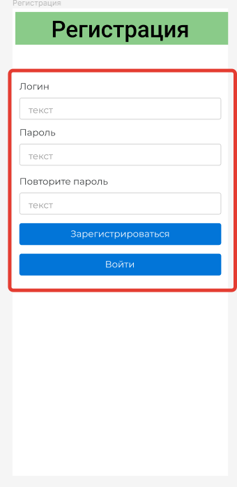
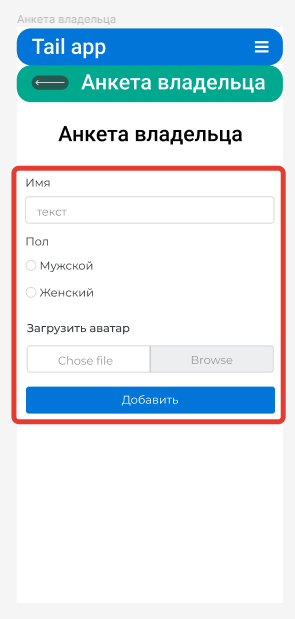
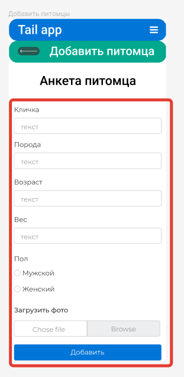
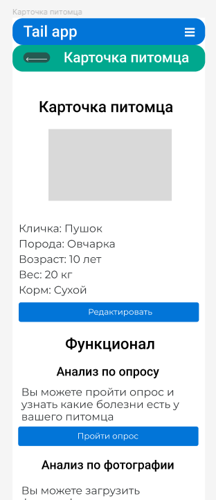
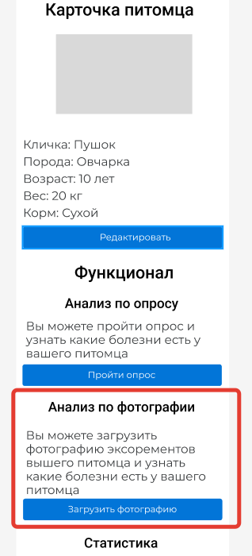
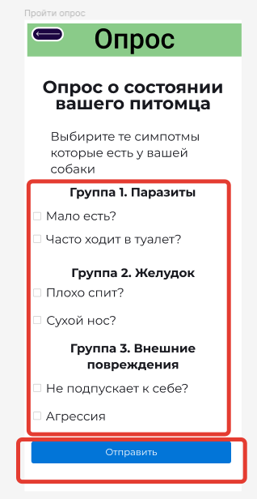
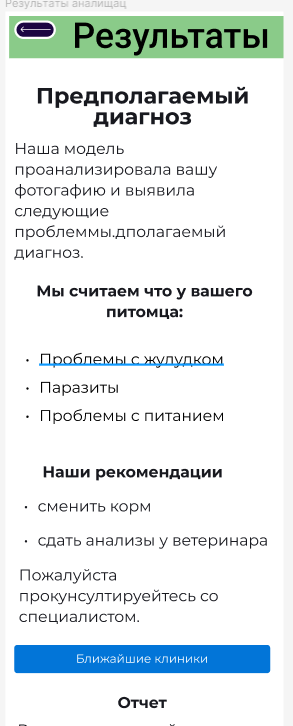
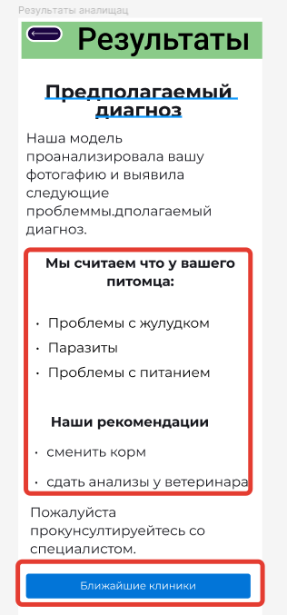
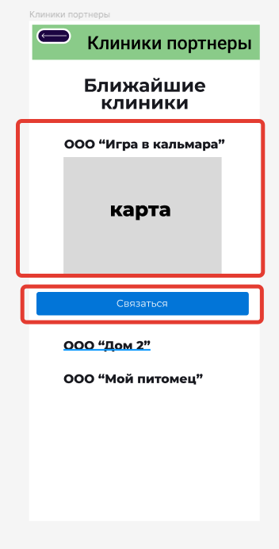

# Основной функционал приложения

### Шаги по использованию приложения&#x20;

1. Главная
2. Регистрация
3. Вход
4. Анкета владельца
5. Добавление питомца
6. Отправка фото на определение болезни питомца
7. Прохождение теста на определение болезни питомца
8. Результаты
9. Просмотр список ближайших поликлиник

Дополнительный функционал&#x20;

* чат с экспертом
* википедия по болезням

### Подробное описание функционала

#### 1.  Главная странице&#x20;

\_\_На главной странице расположена вся информация о проекте.&#x20;

Для регистрации:

* на странице "Главная"
* нажать на кнопку "Присоединиться"
* откроется страница "Регистрация"

или

Для входа:

* на странице "Главная"&#x20;
* нажать на кнопку "Войти"
* откроется страница "Вход"

<figure><figcaption>
Страница "Главная"
</figcaption></figure>

#### 2.  Регистрация

\_\_На странице "Регистрация" расположена форма для регистрации новых пользователей.

Для регистрации:

* На странице "Регистрация"
* заполнить поля формы&#x20;
* Нажать кнопку отправить
* откроется страница "Вход"

<figure><figcaption></figcaption></figure>

#### 3.  Вход

\_\_На странице "Вход" расположена форма для входа уже зарегистрированных  пользователей.

Для входа в приложение:

* на странице "Вход"
* &#x20;заполнить поля формы&#x20;
* Нажать кнопку отправить
* откроется "Анкета владельца"

<figure><figcaption>
Страница "Вход"
</figcaption></figure>

#### 4.  Анкета владельца

\_\_На странице "Анкета" расположена форма для ввода данных о владельце питомца.

Для заполнении анкеты:

* на странице "Анкета владельца"&#x20;
* заполнить поля формы&#x20;
* Нажать отправить
* откроется "Личный кабинет"

<figure><figcaption>
Страница "Анкета владельца"
</figcaption></figure>

#### 5.  Добавление питомца

\_\_На странице "Личный кабинет" расположен список ваших питомцев. А также интерфейс для взаимодействия с ними: добавления питомцев и редактирования уже добавленных питомцев.

Для добавления питомца:

* на странице "Личный кабинет"
* нажать кнопку добавить
* откроется форма "Добавление питомца"
* заполнить поля формы&#x20;
* нажать кнопку отправить
* откроется страница "Карточка питомца"

<figure><figcaption>
Страница "Личный кабинет" - добавление питомца
</figcaption></figure>

<figure><figcaption>
Страница "Анкета питомца"
</figcaption></figure>

<figure><figcaption>
Страница "Карточка питомца"
</figcaption></figure>

#### 6.  Отправка фото на определение болезни питомца

\_\_На странице "Карточка питомца" расположен функционал для работы с вашим питомцем: отправка фотографии на на определения болезней и прохождение опроса на определения болезней.

Для загрузки фотографии на определение болезней:

* на странице "Карточка питомца"
* нажать кнопку "загрузить фотографию"
* откроется форма "Отправка фотографии"
* сделать фотографию на телефоне
* нажать на поле "добавить фото" и прикрепить сделанную фотографию
* нажать на кнопку отправить
* откроется страница "Результаты"

<figure><figcaption>
Страница "Карточка питомца" - загрузка фотографии
</figcaption></figure>

<figure><figcaption>
Страница "Отправка фотографии" - отправить фото
</figcaption></figure>

<figure><figcaption>
Страница "Результаты"
</figcaption></figure>

#### 7.  Прохождение теста на определение болезни питомца

\_\_На странице "Карточка питомца" расположен функционал для работы с вашим питомцем: отправка фотографии на на определения болезней и прохождение опроса на определения болезней.

Для прохождения опроса на определение болезней:

* на странице "Карточка питомца"
* нажать кнопку "пройти опрос"
* откроется форма "Опрос"
* заполнить поля формы
* нажать на кнопку отправить
* откроется страница "Результаты"

<figure><figcaption>
Страница "Карточка питомца" - пройти опрос
</figcaption></figure>

<figure><figcaption>
Страница "Опрос"
</figcaption></figure>

<figure><figcaption>
Страница "Результаты"
</figcaption></figure>

#### 8.  Результаты

\_\_На странице результаты вы можете увидеть болезни которые есть у вашего питомца.

<figure><figcaption>
Страница "Результаты"
</figcaption></figure>

Для получения списка клиник:

* на странице "Результаты"
* нажмите кнопку "Ближайшие клиники"
* откроется страница "Ближайшие клиники"

<figure><figcaption>
Страница "Результаты" - ближайшие поликлиники
</figcaption></figure>

<figure><figcaption>
Страница "Клиники"
</figcaption></figure>
